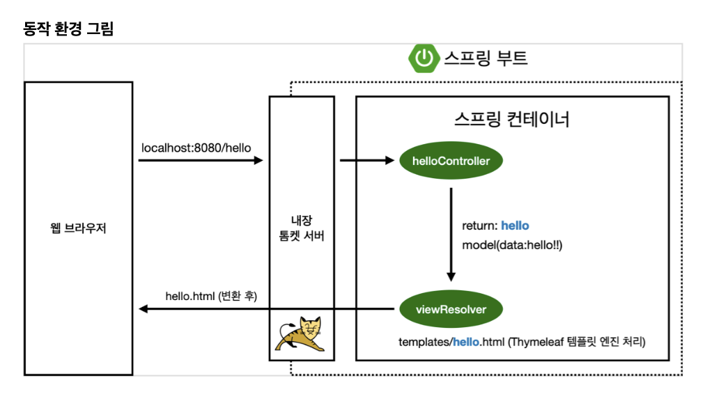

### 실행개요

1. controller한테 url 요청을 보내게 되고

2. 톰캣서버가 이를 받아서 (보통은 스프링 부트에서 내장 톰캣을 사용) dispatcher가 이를 담당하는 컨테이너를 찾아 전달하게 된다.

3. 그리고 resource에서 template나 static 을 보고 viewResolver가 화면에 뿌려주게 된다.

4. 정확하게는 html파일을 웹 브라우저 돔에다 던져준다고 하자!



빌드할때는 `gradle`의 경우에

```
$ ./gradlew build
# java -jar hello-spring-x.x.1-SNAPSHOT.jar
```
